# 100x.Devs-Cohort2.0
## 1.HTML notes 
*-> using of google meta tags will be helpful in SEO practice*
## 

##### a. attributes in html-All HTML elements can have attributes 
##### b. Attributes provide additional information about elements
##### c. mdn reference(read DOCUMENT)
##### <pre>"pre" tag to be used for as extract the input as it is 
##### d. A screen reader is a software application that converts digital text into audio or tactile form.
#### 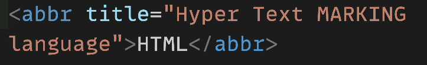
#### 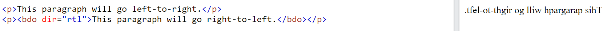
#### 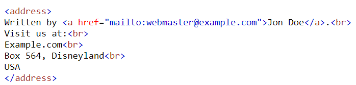
#####  <pre> 'a' tag is used to link the static page address 
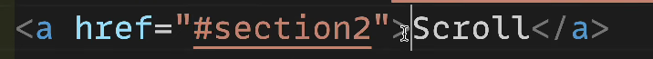
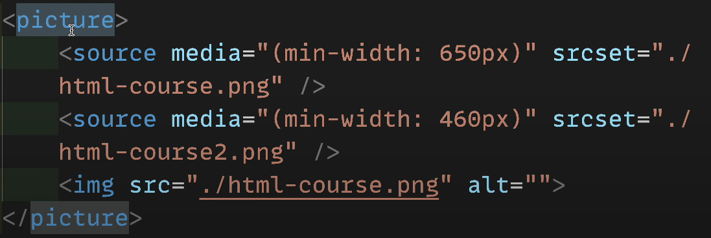
#####  <pre> ' map name' tag is used to link addres on clicking particular section on image, function can be used onclick
https://www.image-map.net/
##### e. Tables in html 
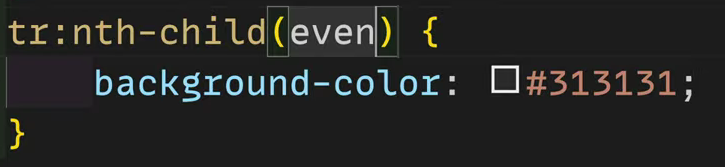
##### 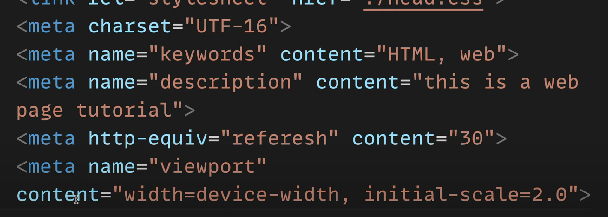
##### 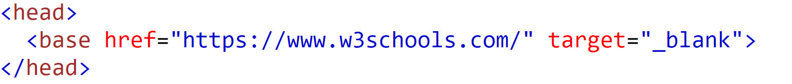
##### f. Semantic tags "header,nav,section,article,aside,footer,summary,details" 
##### A semantic element clearly describes its meaning to both the browser and the developer.
Examples of non-semantic elements: div> and span> - Tells nothing about its content.
Examples of semantic elements: form>, table>, and article> - Clearly defines its content
## CSS(TAILWIND) NOTES:
##### a. as a developers we should analize an website and divide it into rows to make it simpler , lets see down a example.
### 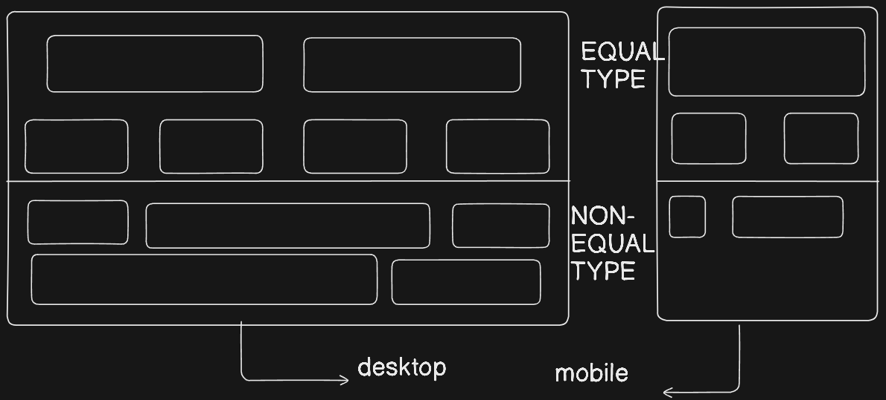
# 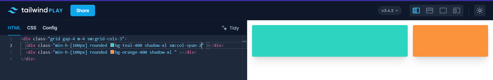

### 

# 

#### b. above code is an example using tailwind play to demonstrate how the rows play the crucial role in understanding any website design and divide thm into rows / blocks
## JS-🍵
.png>)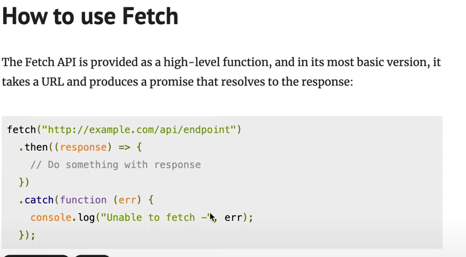
https://developer.mozilla.org/en-US/docs/Web/API/fetch