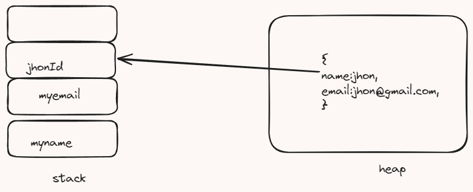

## https://developer.mozilla.org/en-US/docs/Web/JavaScript/Data_structures

++++++++++++++++++++++++++++++++++++++++++++++++
# Memory discussion 
1. stack(primitive dataypes)
2. heap(non-primitive datatypes)

1) stack is generally storing the values of the primitive data types
2) Heap is used to store the objects/values of a variable and its reference is stored in the stack
